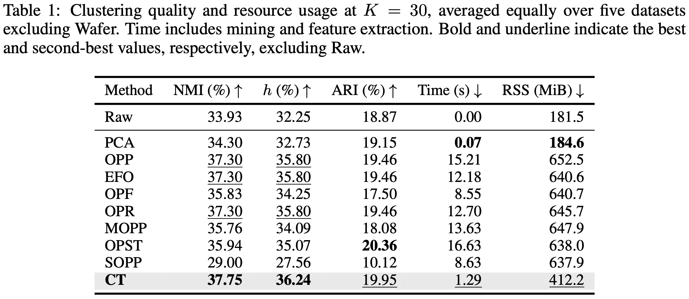
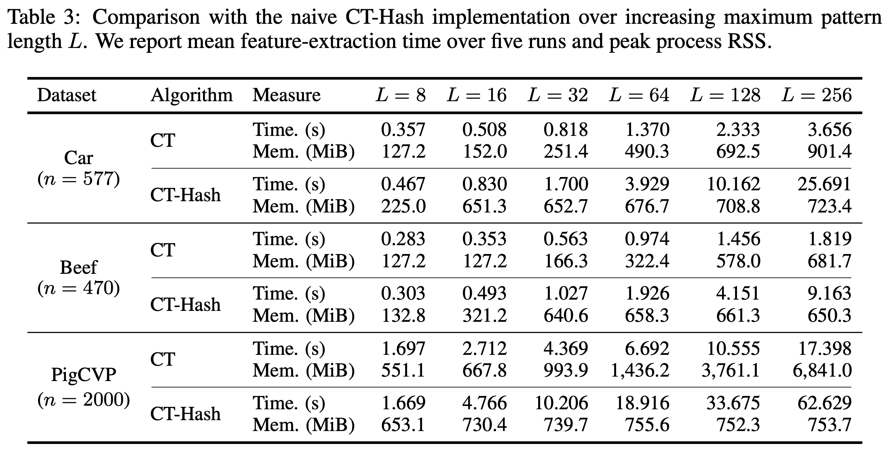
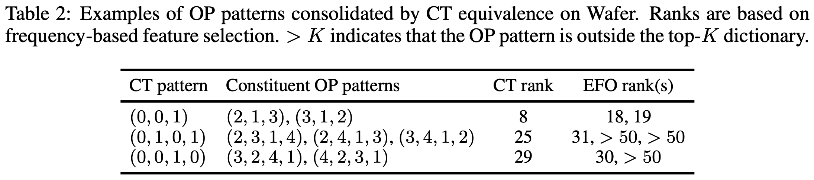
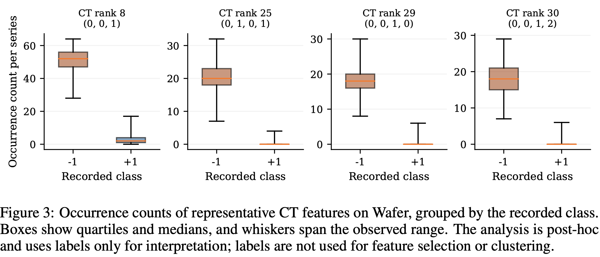

# CT-Miner

<p align="center">
  <strong>Fast and Coarse-Grained Time-Series Pattern Mining via Cartesian Trees</strong>
</p>

<p align="center">
  
  
  
</p>

<p align="center">
  <a href="#overview">Overview</a> ·
  <a href="#quickstart">Quickstart</a> ·
  <a href="#repository-layout">Repository layout</a> ·
  <a href="#experiments">Experiments</a> ·
  <a href="#main-results">Main results</a>
</p>

## Overview

CT-Miner discovers recurring Cartesian-tree patterns in time series and turns their occurrence counts into features for clustering. It groups windows by tree structure, capturing shared relationships between values without requiring the same full rank ordering.

## What makes CT-Miner different?

- **Structure-based patterns.** Windows such as `[2, 1, 3]` and `[3, 1, 2]` share the same Cartesian-tree shape despite different rank orders, enabling compact feature representations by pooling ordinal variants.
- **Reuse through indexing.** A Cartesian suffix tree reuses shared structure across overlapping subsequences, with support-threshold and top-K feature selection.
- **Quadratic occurrence collection.** For a sequence of length $n$, exhaustive CT-pattern occurrence collection takes $O(n^2)$ time using compact node-based outputs, compared with $O(n^4)$ for naive pairwise counting. This bound concerns occurrence collection, not the complete clustering pipeline.
- **Compact, useful features.** CT preserves clustering quality comparable to OP-based representations under limited feature budgets, with **6.6× faster mean feature construction** than the fastest evaluated pattern-mining baseline at K = 30.

## Quickstart

Create the Python and Java environment from the repository root:

```bash
conda env create -f environment.yml
conda activate ct-miner
python -m pip install -r requirements.txt
python run.py build
python run.py validate
```

The validation command uses small synthetic inputs, including repeated values, checks clustering, and verifies CT patterns, occurrence counts, and feature matrices against the Python reference and CT-Hash. No dataset download is needed.

> [!IMPORTANT]
> Third-party baseline implementations are not redistributed.

Prepare the six UCR datasets before running experiments:

```bash
python run.py prepare
```

### Environment updates and data preparation options

- Update an existing environment with `conda env update -f environment.yml`, activate it, and rebuild.
- Check the toolchain and compiled classes with `python run.py build --check`.
- Retry failed downloads with `python run.py prepare --retry-failed`, keeping any original `--cache` and `--output` options.
- Reuse UCR `.ts` files with `python run.py prepare --cache /path/to/ucr-cache`, arranged as `<dataset>/<dataset>_TRAIN.ts` and `<dataset>/<dataset>_TEST.ts`.
- Check real-data excerpts with `python run.py validate --prepared data/prepared --output results/validation/prepared.json`. Validation checks functionality, not full benchmark scores or timings; choose a new output path for each run.

Data preparation uses aeon with a checksummed Zenodo fallback. Expected array fingerprints are defined in [experiments/datasets.json](experiments/datasets.json). Prepared data and source hashes are recorded in `data/prepared/manifest.json`.


## Repository layout

| Path | Contents |
| --- | --- |
| [ctminer/](ctminer/) | Java miner, Python reference, feature adapters, and workers |
| [baseline/common/](baseline/common/) | Shared Java transport, CT collection, and validation utilities |
| [baseline/ct_hash/](baseline/ct_hash/) | Our independent-window CT-Hash baseline |
| [experiments/](experiments/) | Clustering, CT/CT-Hash comparison, and memory experiments |
| [scripts/](scripts/) | Build, data preparation, validation, and result collection |
| [run.py](run.py) | Unified command-line entry point |

Generated classes, datasets, and outputs go to `build/`, `data/`, and `results/`. Relative command-line paths resolve against the repository root.


## Experiments

The paper compares **CT** with OPP, EFO, OPF, OPR, MOPP, OPST, SOPP, Raw, and PCA across the five main datasets and the separate Wafer case study. This release runs CT by default, with optional Raw/PCA references via `--methods CT Raw PCA`. The baseline results reported below come from the paper, not from bundled third-party implementations.

| Study | Question | Default settings |
| --- | --- | --- |
| Top-K clustering | How useful are small pattern dictionaries? | K = 10, 20, 30, 40, 50; minsup = 2 |
| Threshold clustering | How does minimum support affect the features? | minsup = 5, 10, 25 |
| Input scaling | How do quality and resource use change with sequence length? | 20–100% input prefixes; K = 30 |

### Running experiments

```bash
python run.py clustering plan
python run.py clustering run --jobs 1

python run.py input-scaling plan
python run.py input-scaling run --jobs 1
```

### Comparing CT with CT-Hash

CT-Hash independently encodes and hashes each window. The comparison sweeps maximum pattern length and input length with K = 30, checking identical ordered patterns, supports, and feature matrices.

```bash
python run.py hash plan --output results/hash
python run.py hash run --output results/hash
python run.py hash summarize results/hash
```

### Measuring feature-construction memory

```bash
python run.py memory plan
python run.py memory run --jobs 1
python run.py memory collect
```

Add `--include-hash` to memory `plan` and `run` to include CT/CT-Hash sweeps.

Run timing comparisons without other experiments executing concurrently. Use `python run.py <command> --help` for command-specific options.

### Inspecting results

```bash
python run.py collect results/clustering/topk
python run.py collect results/clustering/threshold
python run.py collect results/clustering/input_length
```

Clustering outputs include `all_conditions.csv`, `dataset_tables.md`, and `failures.json`. `feature_peak_rss_mib` measures the maximum sampled RSS sum of the Python worker and its descendants during feature construction, excluding clustering (50 ms sampling by default).

## Main results

Aggregate results use `Car, Beef, ElectricDevices, MoteStrain, and PigCVP`, with equal dataset weighting. Wafer is used for a case study, excluded from these averages. Clustering uses five random seeds. Reported times cover feature construction, including invocation overhead, and exclude clustering.

### 1. Comparable clustering quality at much lower construction cost



At K = 30, CT achieves **37.75% NMI, 36.24% homogeneity, and 19.95% ARI**. NMI and homogeneity are the highest among the evaluated pattern-based methods, while ARI is close to OPST's best score of **20.36%**. Mean feature-construction time is **1.29 s**, versus **8.55–16.63 s** for the other pattern-mining methods: approximately **6.6× faster** than the fastest of them, OPF.

These results show that coarser CT equivalence can retain useful clustering information while substantially reducing feature-construction cost. The timing comparison covers the complete feature pipelines, including their adapters and selection steps.

### 2. Larger runtime gains for longer patterns



CT-Miner's runtime advantage over CT-Hash, which independently encodes and hashes each window, grows with the maximum pattern length on the evaluated long-sequence datasets. On Car at L = 256, CT takes **3.656 s**, compared with **25.691 s** for CT-Hash: approximately **7.0× faster**, with matching mining outputs.

Reusing shared Cartesian suffix-tree structure avoids repeated work on overlapping windows. For maximum pattern length $L$, the paper analyzes $O(nL)$ occurrence collection for CT versus expected $O(nL^2)$ for CT-Hash. This practical hashing comparison is distinct from the naive pairwise $O(n^4)$ bound above. Retaining shared structure can require more memory, especially for long sequences and large $L$; the benefit is improved runtime scalability through reduced recomputation.

### 3. Pooling OP patterns into useful CT features




On Wafer, the CT feature ranked 25th combines three OP patterns, two of which fall outside EFO's top-50 dictionary. The CT feature ranked 29th combines two OP patterns, one outside EFO's top 50. Pooling their occurrences promotes each shared structure into a single highly ranked feature.

These representative CT features have high occurrence counts in recorded class (−1) and nearly zero counts in (+1). The case study illustrates how CT equivalence concentrates frequency information spread across finer-grained OP patterns, preserving useful structure within a limited feature budget. This is a post-hoc interpretation, not a causal feature ablation; labels are not used to select patterns.

## Release scope

For licensing reasons, we release only our own implementations, including CT-Hash, and do not redistribute third-party baseline implementations. Baseline comparisons above describe the paper's experiments.
